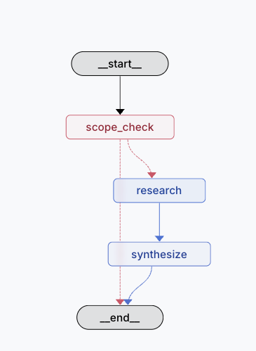

# Research Agent Framework

A LangGraph-based research agent that provides factual, academic, and economic research using free APIs.

Design Decisions: 
ReAct Agent for tool routing - This is how langgraph does this under the hood so I decided to go with it rather than fight it, its more token efficient as well so it makes sense for a free project. It uses the description of the tools given and a light model to decide what tool to use for each query. It's quick and accurrate. 

I went with the free teir of gemini for this as well, it seemed like the strongest model with a free teir. I haven't tried grok. Given how many external requests we were already making with all the tools I didn't think a larger public model made sense, latency is already high with the agent. With Gemini 2.5 Flash we get quick and accurate responses. 

I added a "tools used" section in the response from the agent but I'd rely on a library for charting this stuff typically. In this case, with the library I've chosen they offer LangSmith which is a great tool for monitoring/logging/evals for agent development.



## Setup

```bash
# Depending on your python you may need to activate an environment in which case use the two lines commented below:
# python3 -m venv .venv
# source .venv/bin/activate

# Otherwise just install requirements.txt
pip install -r requirements.txt
```

```bash
# Set ENV Vars
FRED_API_KEY=******
GOOGLE_AI_STUDIO_API_KEY=******
```

## Running the Agent

```bash
python agent.py "What is Basel III?"
python agent.py --verbose "What is Basel III?"
```

## Running Tests

```bash
python -m pytest tests/ -v
```

Or run a specific test:

```bash
python -m pytest tests/test_scope_validation.py -v
```
